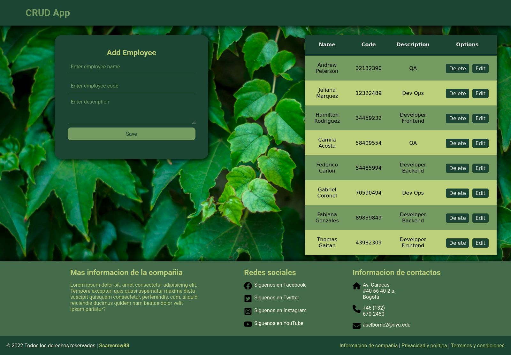
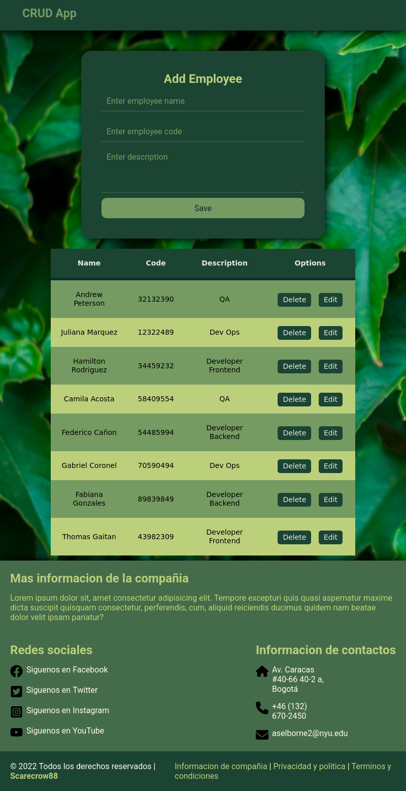
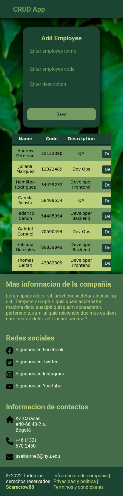

# CRUD App
## Funcionalidades
- Crear nuevos registros
- Listar registros
- Editar registros existentes
- Eliminar registros
- Validaciones básicas en formularios
## Tecnologías utilizadas
- **Frontend:** React.js, JavaScript, HTML, CSS
## Arquitecturas
- Monolitica
> Vista 1 de la pagina  
  
> Vista 2 de la pagina  
  
> Vista 3 de la pagina  
  
# **Nota:** Antes de salir, pasate a ver las branches